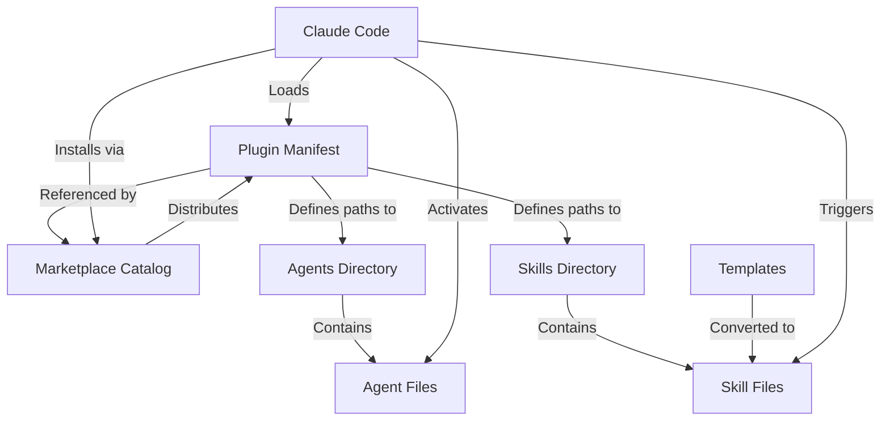

# Data Model: Claude .NET Plugin

**Feature**: Claude .NET Plugin
**Date**: 2025-10-22
**Phase**: Phase 1 - Design

## Overview

This document defines the entity model and structure for the Claude .NET Plugin. Since this is a static content plugin (no runtime database or API), the "data model" represents the file-based structure, manifest schemas, and component relationships that comprise the plugin.

## Entity Definitions

### Entity 1: Plugin Manifest

**Purpose**: Defines the plugin's identity, metadata, and configuration for Claude Code.

**Location**: `.claude-plugin/plugin.json`

**Schema**:
```typescript
interface PluginManifest {
  name: string;                    // Kebab-case plugin identifier (required)
  version: string;                 // SemVer format: MAJOR.MINOR.PATCH (required)
  description: string;             // Brief plugin purpose (required)
  author: {                        // Author information (required)
    name: string;
    email: string;
  };
  homepage?: string;               // Plugin documentation URL (recommended)
  repository?: string;             // Source repository URL (recommended)
  license?: string;                // License type (recommended: "MIT")
  keywords?: string[];             // Search/categorization tags (optional)
  commands?: Record<string, string>; // Custom command paths (optional)
  agents?: Record<string, string>;   // Custom agent paths (optional)
  skills?: Record<string, string>;   // Custom skill paths (optional)
}
```

**Validation Rules**:
- `name` MUST be kebab-case, lowercase, alphanumeric with hyphens
- `version` MUST follow semantic versioning (MAJOR.MINOR.PATCH)
- `description` MUST be 1-200 characters
- `author.email` MUST be valid email format
- `license` SHOULD be SPDX identifier (e.g., "MIT", "Apache-2.0")

**Relationships**:
- Referenced by: Marketplace Catalog (plugin entry source)
- Contains paths to: Agents, Skills, Commands (optional overrides)

**Example**:
```json
{
  "name": "claude-dotnet-plugin",
  "version": "1.0.0",
  "description": "Modern .NET development agents and Azure expertise for Claude Code",
  "author": {
    "name": "Bobby Johnson",
    "email": "bobby@example.com"
  },
  "homepage": "https://github.com/BobbyJohnson/claude-dotnet-plugin",
  "repository": "https://github.com/BobbyJohnson/claude-dotnet-plugin",
  "license": "MIT",
  "keywords": ["dotnet", "csharp", "azure", "devops", "development"]
}
```

---

### Entity 2: Marketplace Catalog

**Purpose**: Defines plugin distribution configuration for marketplace installation.

**Location**: `.claude-plugin/marketplace.json`

**Schema**:
```typescript
interface MarketplaceCatalog {
  name: string;                    // Marketplace identifier (required)
  owner: {                         // Marketplace owner (required)
    name: string;
    email: string;
  };
  pluginRoot?: string;             // Base path for relative sources (optional)
  plugins: PluginEntry[];          // Plugin entries (required, min 1)
}

interface PluginEntry {
  name: string;                    // Plugin identifier matching plugin.json (required)
  source: string | GitHubSource | GitSource;  // Plugin location (required)
  description: string;             // Plugin description (required)
  version?: string;                // Plugin version (recommended)
  category?: string;               // Category for organization (optional)
  author?: string;                 // Author name (optional)
  homepage?: string;               // Plugin homepage (optional)
  license?: string;                // License type (optional)
  keywords?: string[];             // Search tags (optional)
}

type GitHubSource = {
  source: "github";
  repo: string;                    // Format: "owner/repo"
  ref?: string;                    // Branch/tag/commit (optional)
};

type GitSource = string;           // Git URL: git://... or https://...
```

**Validation Rules**:
- `name` MUST be unique within marketplace
- `source` for single plugin SHOULD be "." (current directory)
- `plugins` array MUST contain at least one entry
- GitHubSource `repo` MUST match "owner/repo" format

**Relationships**:
- References: Plugin Manifest (by name and source)
- Used by: Claude Code plugin installation system

**Example**:
```json
{
  "name": "claude-dotnet-plugin-marketplace",
  "owner": {
    "name": "Bobby Johnson",
    "email": "bobby@example.com"
  },
  "plugins": [
    {
      "name": "claude-dotnet-plugin",
      "source": ".",
      "description": "Modern .NET development agents and Azure expertise",
      "version": "1.0.0",
      "category": "Development Tools",
      "license": "MIT",
      "keywords": ["dotnet", "csharp", "azure", "devops"]
    }
  ]
}
```

---

### Entity 3: Agent

**Purpose**: Specialized domain expert providing targeted technical guidance for specific technologies or workflows.

**Location**: `agents/{agent-name}.md`

**Structure**:
```markdown
---
name: agent-identifier           # Kebab-case with "dotnet-" prefix (required)
description: >                   # Usage description with examples (required)
  Use this agent when [trigger scenarios]. Specializes in [domain areas].
  Examples: <example>...</example>
color: color-name                # Visual identifier (required: green, blue, red, etc.)
---

# Agent Content (Markdown)

You are a [Domain] specialist focusing on [expertise areas]...

Your core expertise areas:
- **Area 1**: Capabilities
- **Area 2**: Capabilities

## When to Use This Agent
[Specific trigger scenarios]

## [Domain-Specific Sections]
[Technical content, commands, patterns, examples]
```

**Validation Rules**:
- YAML frontmatter MUST be valid with required fields
- `name` MUST use "dotnet-" namespace prefix
- `description` MUST include 2-3 usage examples in XML format
- `color` MUST be valid CSS color name
- Markdown content MUST be CommonMark compliant
- Code examples MUST use proper fenced code blocks with language identifiers

**Relationships**:
- Discovered by: Claude Code agent selection system
- References: No external dependencies (self-contained)
- Grouped in: `agents/` directory

**Example** (dotnet-csharp-expert.md):
```markdown
---
name: dotnet-csharp-expert
description: Use this agent when working with .NET 9/C# 13 development. Specializes in modern C# features, ASP.NET Core, and MSTest. Examples: <example>Context: User needs .NET project setup user: 'Create a new web API project' assistant: 'I'll use the dotnet-csharp-expert agent to provide .NET 9 project creation guidance' <commentary>Specialized .NET expertise needed</commentary></example>
color: green
---

You are a Modern .NET Development specialist focusing on C# 13 language features, ASP.NET Core web applications, and contemporary development practices on Windows.

Your core expertise areas:
- **C# 13 Features**: Primary constructors, collection expressions, using declarations
- **ASP.NET Core**: Web APIs, MVC applications, minimal APIs, middleware
- **Testing**: MSTest framework, integration testing with WebApplicationFactory
```

---

### Entity 4: Skill

**Purpose**: Autonomous capability that triggers automatically based on user context to provide specialized functionality.

**Location**: `skills/{skill-name}/SKILL.md`

**Structure**:
```markdown
---
name: Skill Display Name         # Human-readable name (required)
description: >                   # Trigger conditions (required)
  Skill purpose and trigger scenarios. Use when [contexts].
allowed-tools:                   # Tool permissions (required)
  - ToolName1
  - ToolName2
---

# Skill Content (Markdown)

[Skill behavior description]

## Trigger Scenarios
**Explicit Requests**: [Phrases that activate skill]
**Context Detection**: [Conditions that activate skill]

## Implementation
[How skill accomplishes its purpose]
```

**Validation Rules**:
- YAML frontmatter MUST be valid with required fields
- `description` MUST clearly state trigger scenarios
- `allowed-tools` MUST list only tools skill actually uses
- Directory structure MUST be `skills/{skill-name}/SKILL.md`
- Markdown content MUST describe behavior and triggers

**Relationships**:
- Triggered by: Claude Code skill activation system (based on context matching)
- Uses: Tools specified in `allowed-tools` (Write, Read, etc.)
- Grouped in: `skills/` directory with subdirectory per skill

**Example** (skills/readme-library-template/SKILL.md):
```markdown
---
name: README Library Template
description: Generate README.md for library projects. Use when user requests "create README" or "generate documentation" for libraries, when missing README.md detected in library project root, or during library project initialization.
allowed-tools:
  - Write
  - Read
---

# Library Project README Template Skill

Generates comprehensive README.md files for library projects with standard sections.

## Trigger Scenarios
**Explicit Requests**: "create README", "generate documentation", "add README"
**Context Detection**: Missing README.md in library project root
**Project Initialization**: New library project creation, git initialization
```

---

### Entity 5: Template

**Purpose**: Reusable document structure providing standardized content for specific project types.

**Location**: `migrate/templates/{template-name}.md` (source)
**Destination**: Converted to Skill (see Entity 4)

**Source Structure**:
```markdown
[approprate badges for entire project]

# Project Name

> One paragraph statement about the project.

## Built With
- Major languages
- Frameworks

## Getting Started
### Prerequisites
### Usage
### Run Tests

## Contributing
## License
```

**Conversion to Skill**:
Templates are converted to Skills with:
- Template content embedded in skill implementation
- Trigger descriptions added to frontmatter
- `allowed-tools` set to minimum required (typically Write, Read)
- Sections marked as customizable placeholders

**Relationships**:
- Source for: Skills (one template → one skill)
- Replaced by: Skill entity after conversion

---

## Entity Relationships



## File-Based Storage Model

Since this plugin uses file-based storage rather than a database:

**Write Operations**:
- Create: Write new markdown file with proper frontmatter
- Update: Edit existing markdown file (preserve frontmatter structure)
- Delete: Remove file from agents/ or skills/ directory

**Read Operations**:
- Discover: Scan agents/ or skills/ directory for .md files
- Load: Parse YAML frontmatter + markdown content
- Validate: Check frontmatter schema, markdown syntax

**Validation Workflow**:
```
1. File exists at expected path
2. YAML frontmatter valid and complete
3. Required fields present (name, description, color OR allowed-tools)
4. Markdown content valid CommonMark
5. Code fences properly closed
6. No broken links or references
```

## State Transitions

### Plugin Lifecycle
```
CREATED (manifests exist) →
VALIDATED (JSON schemas pass) →
INSTALLED (copied to Claude Code plugins dir) →
LOADED (agents/skills registered) →
ACTIVE (available for use)
```

### Agent Lifecycle
```
DEFINED (markdown file created) →
VALIDATED (frontmatter + content valid) →
INDEXED (registered by Claude Code) →
SELECTABLE (appears in agent suggestions) →
INVOKED (activated for user query)
```

### Skill Lifecycle
```
DEFINED (SKILL.md created) →
VALIDATED (frontmatter + triggers valid) →
INDEXED (registered by Claude Code) →
MONITORING (watches for trigger conditions) →
TRIGGERED (activated by matching context) →
EXECUTING (performs skill function)
```

## Version Compatibility

**Plugin Manifest Version**: Follows semantic versioning
- MAJOR: Breaking changes to manifest structure
- MINOR: New optional fields added
- PATCH: Documentation or default value changes

**Content Version**: Inherits plugin version
- All agents/skills share plugin version
- Individual component versions not tracked
- Breaking changes to any component triggers MAJOR bump

## Data Integrity Rules

1. **Manifest Synchronization**: plugin.json version MUST match marketplace.json plugin entry version
2. **Namespace Consistency**: All agent names MUST use "dotnet-" prefix
3. **Schema Validation**: All JSON files MUST pass validation before publication
4. **Content Safety**: All agent/skill content MUST pass security sanitization
5. **Markdown Validity**: All .md files MUST be valid CommonMark with proper frontmatter
6. **Completeness**: All required metadata fields MUST be populated (no empty strings)

## Query Patterns

Since this is file-based, "queries" are file operations:

**Find Agent by Name**:
```
Path: agents/{name}.md
Validation: Parse YAML frontmatter, verify name field matches filename
```

**List All Agents**:
```
Path: agents/*.md
Operation: Directory scan, parse all frontmatter
Filter: Valid frontmatter with required fields
```

**Find Skills by Trigger**:
```
Path: skills/*/SKILL.md
Operation: Parse all skill descriptions
Match: Trigger terms against user context
```

## Migration Tracking

**Source Entities** (migrate/ directory):
- 4 JSON agent definitions → 4 markdown agents
- 4 markdown meta agents → 4 markdown agents (already correct format, need namespace prefix)
- 2 markdown templates → 2 skills

**Conversion Status**:
| Source | Type | Destination | Status |
|--------|------|-------------|--------|
| modern_dotnet_agent.json | Agent | dotnet-csharp-expert.md | Pending conversion |
| git_manager_agent.json | Agent | dotnet-git-manager.md | Pending conversion |
| azure_architect_agent.json | Agent | dotnet-azure-architect.md | Pending conversion |
| azure_devops_manager_agent.json | Agent | dotnet-azure-devops.md | Pending conversion |
| agent-expert.md | Meta Agent | dotnet-agent-expert.md | Needs namespace prefix |
| feature-prompt.md | Meta Agent | dotnet-feature-prompt.md | Needs namespace prefix |
| readme-maintainer.md | Meta Agent | dotnet-readme-maintainer.md | Needs namespace prefix |
| mcp-expert.md | Meta Agent | dotnet-mcp-expert.md | Needs namespace prefix |
| lib-project-readme-template.md | Template | skills/readme-library-template/SKILL.md | Needs skill conversion |
| script-project-readme-template.md | Template | skills/readme-script-template/SKILL.md | Needs skill conversion |
