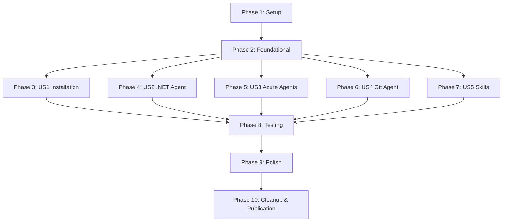

# Implementation Tasks: Claude .NET Plugin

**Feature**: Claude .NET Plugin
**Branch**: `001-installable-plugin`
**Date**: 2025-10-22
**Spec**: [spec.md](./spec.md)
**Plan**: [plan.md](./plan.md)

## Overview

This document defines the execution-ready task list for building the Claude .NET Plugin. Tasks are organized by user story to enable independent implementation and testing, following the priority order from the specification (P1 → P2 → P3).

**Total Tasks**: 176
**MVP Scope**: Phase 1-3 (User Story 1: Plugin Installation and Discovery)

## Task Format

All tasks follow strict format:
```
- [ ] [TaskID] [P?] [Story?] Description with file path
```

- **[P]**: Parallelizable (different files, no dependencies)
- **[Story]**: User story label (US1, US2, US3, US4, US5)

## Phase 1: Setup (Infrastructure)

**Goal**: Initialize plugin directory structure and version control

**Independent Test**: Directory structure exists and matches plan.md specification

### Tasks

- [X] T001 Create plugin root directory at C:\Users\BobbyJohnson\src\claude-dotnet-plugin
- [X] T002 [P] Create .claude-plugin directory for manifests
- [X] T003 [P] Create .claude directory for settings configuration
- [X] T004 [P] Create agents directory for agent markdown files
- [X] T005 [P] Create skills directory for skill definitions
- [X] T006 [P] Create tests directory for automated test suite
- [X] T007 [P] Create docs/research directory
- [X] T008 Initialize git repository in plugin root with initial commit

**Completion Criteria**: All directories exist, git initialized

---

## Phase 2: Foundational (Blocking Prerequisites)

**Goal**: Create plugin manifests and settings required for all user stories

**Independent Test**: Manifests validate with ConvertFrom-Json, versions synchronized, settings.json valid

### Tasks

- [X] T009 Create .claude-plugin/plugin.json with name, version 1.0.0, description, author, repository, license, keywords per FR-001
- [X] T010 Create .claude-plugin/marketplace.json with owner, plugins array, source "." per FR-002
- [X] T011 Copy .claude/settings.json from project root to plugin .claude/settings.json per FR-024
- [X] T012 Validate plugin.json syntax with PowerShell ConvertFrom-Json
- [X] T013 Validate marketplace.json syntax with PowerShell ConvertFrom-Json
- [X] T014 Validate settings.json syntax with PowerShell ConvertFrom-Json per FR-029
- [X] T015 Verify settings.json contains required permissions: pwsh, git, dotnet, az, docker per FR-024
- [X] T016 Verify version synchronization between plugin.json (1.0.0) and marketplace.json (1.0.0)
- [X] T017 Create development marketplace directory at C:\dev\claude-marketplaces\dev-marketplace\.claude-plugin
- [X] T018 Create dev marketplace.json with absolute path source: C:/Users/BobbyJohnson/src/claude-dotnet-plugin
- [X] T019 Commit manifests and settings with message "feat: add plugin manifests and settings configuration"

**Completion Criteria**: All manifests valid JSON, versions match, settings.json configured, dev marketplace ready

---

## Phase 3: User Story 1 - Plugin Installation and Discovery (P1)

**Story Goal**: Enable users to install plugin and verify it appears in Claude Code without errors

**Independent Test**: Install via dev marketplace, run /help, verify metadata visible, no load errors

**Acceptance Scenarios**:
1. Plugin installs successfully and appears in enabled plugins list
2. `/help` command shows plugin information with descriptions
3. Plugin details display complete metadata (version, author, description, homepage)

### Tasks

- [X] T020 [US1] Create basic README.md in plugin root with title, description, and placeholder sections per FR-010
- [X] T021 [US1] Add Features section to README.md listing planned agents and skills
- [X] T022 [US1] Add Installation section to README.md with marketplace add command
- [X] T023 [US1] Add Requirements section to README.md (Claude Code 6-month version, Git, Windows 11)
- [X] T024 [US1] Add Settings section to README.md documenting automatic permission grants from settings.json
- [X] T025 [US1] Create LICENSE file with MIT license text per FR-018
- [X] T026 [US1] Create .gitignore file with OS and IDE exclusions
- [X] T027 [US1] ~~Add CLAUDE.md to .gitignore~~ DECISION: Keep in repository for contributor transparency
- [X] T028 [US1] ~~Add .specify/ to .gitignore~~ DECISION: Keep in repository for contributor transparency
- [X] T029 [US1] Commit documentation with message "docs: add README, LICENSE, and gitignore"
- [ ] T030 [US1] Test installation: /plugin marketplace add C:\dev\claude-marketplaces\dev-marketplace
- [ ] T031 [US1] Test installation: /plugin install claude-dotnet-plugin@dev-marketplace
- [ ] T032 [US1] Verify plugin appears in enabled plugins list
- [ ] T033 [US1] Run /help and verify plugin information displays
- [ ] T034 [US1] Check plugin details for complete metadata
- [ ] T035 [US1] Uninstall plugin for next iteration: /plugin uninstall claude-dotnet-plugin@dev-marketplace

**Completion Criteria**: Plugin installs successfully, metadata visible, /help shows plugin, all acceptance tests pass

**MVP Milestone**: With Phase 1-3 complete, plugin is minimally viable (installable and discoverable)

---

## Phase 4: User Story 2 - .NET Development Agent Usage (P1)

**Story Goal**: Provide specialized .NET 9/C# 13 development guidance through dotnet-csharp-expert agent

**Independent Test**: Ask Claude .NET-specific questions, verify agent activates with accurate guidance

**Acceptance Scenarios**:
1. Questions about C# 13 features trigger agent with modern patterns
2. Web API project requests get proper .NET 9 guidance
3. Build errors receive troubleshooting from agent

### Tasks

- [X] T036 [P] [US2] Read migrate/agents/modern_dotnet_agent.json to understand structure
- [X] T037 [US2] Create agents/dotnet-csharp-expert.md file
- [X] T038 [US2] Add YAML frontmatter to dotnet-csharp-expert.md with name: dotnet-csharp-expert, color: green
- [X] T039 [US2] Add description to frontmatter with 2-3 usage examples in XML format per FR-015
- [X] T040 [US2] Convert agent_definition.description from JSON to markdown opening paragraph
- [X] T041 [US2] Convert scope.technologies from JSON to "Your core expertise areas" section with bullet points
- [X] T042 [P] [US2] Convert commands.project_setup from JSON to "## Project Setup" section with code blocks
- [X] T043 [P] [US2] Convert commands.development from JSON to "## Development Commands" section
- [X] T044 [P] [US2] Convert commands.testing from JSON to "## Testing Commands" section
- [X] T045 [P] [US2] Convert commands.entity_framework from JSON to "## Entity Framework" section
- [X] T046 [P] [US2] Convert csharp_13_patterns from JSON to "## C# 13 Patterns" section
- [X] T047 [P] [US2] Convert development_patterns from JSON to "## Development Patterns" section
- [X] T048 [P] [US2] Convert observability_setup from JSON to "## Observability" section
- [X] T049 [P] [US2] Convert workflows from JSON to "## Workflows" section
- [X] T050 [P] [US2] Convert best_practices from JSON to "## Best Practices" section
- [X] T051 [P] [US2] Convert troubleshooting from JSON to "## Troubleshooting" section
- [X] T052 [US2] Security audit: scan dotnet-csharp-expert.md for credentials, API keys, connection strings per FR-023
- [X] T053 [US2] Replace any real credentials with placeholders (e.g., {API_KEY}, user@example.com, example.com)
- [X] T054 [US2] Validate markdown syntax and code fence closures in dotnet-csharp-expert.md
- [X] T055 [US2] Commit agent with message "feat: add dotnet-csharp-expert agent with .NET 9/C# 13 guidance"
- [ ] T056 [US2] Reinstall plugin: /plugin install claude-dotnet-plugin@dev-marketplace
- [ ] T057 [US2] Test: Ask "How do I create a new .NET 9 web API project?" and verify agent activation
- [ ] T058 [US2] Test: Ask "What are C# 13 primary constructors?" and verify agent provides guidance
- [ ] T059 [US2] Test: Ask "MSTest build error troubleshooting" and verify agent helps diagnose
- [ ] T060 [US2] Verify agent appears in Claude Code with correct name and description

**Completion Criteria**: dotnet-csharp-expert agent loads without errors, activates on .NET questions, provides accurate .NET 9/C# 13 guidance

---

## Phase 5: User Story 3 - Azure and DevOps Agent Support (P2)

**Story Goal**: Provide Azure architecture and DevOps pipeline guidance through specialized agents

**Independent Test**: Ask Azure/DevOps questions, verify appropriate agent activates with relevant guidance

**Acceptance Scenarios**:
1. Azure service selection questions trigger Azure Architect agent
2. CI/CD pipeline requests get Azure DevOps agent guidance
3. Deployment troubleshooting uses appropriate agent

### Tasks

- [ ] T061 [P] [US3] Read migrate/agents/azure_architect_agent.json
- [ ] T062 [P] [US3] Read migrate/agents/azure_devops_manager_agent.json
- [ ] T063 [US3] Create agents/dotnet-azure-architect.md file
- [ ] T064 [US3] Add YAML frontmatter to dotnet-azure-architect.md with name: dotnet-azure-architect, color: blue
- [ ] T065 [US3] Add description with usage examples for Azure architecture scenarios
- [ ] T066 [US3] Convert azure_architect JSON content to markdown sections (services, patterns, architecture)
- [ ] T067 [US3] Security audit dotnet-azure-architect.md for sensitive Azure configurations
- [ ] T068 [US3] Replace real Azure examples with generic placeholder values
- [ ] T069 [US3] Create agents/dotnet-azure-devops.md file
- [ ] T070 [US3] Add YAML frontmatter to dotnet-azure-devops.md with name: dotnet-azure-devops, color: blue
- [ ] T071 [US3] Add description with usage examples for DevOps pipeline scenarios
- [ ] T072 [US3] Convert azure_devops JSON content to markdown sections (pipelines, YAML, releases)
- [ ] T073 [US3] Security audit dotnet-azure-devops.md for sensitive pipeline configurations
- [ ] T074 [US3] Commit agents with message "feat: add Azure Architect and Azure DevOps agents"
- [ ] T075 [US3] Reinstall plugin and test Azure architecture question activation
- [ ] T076 [US3] Test DevOps pipeline question triggers correct agent
- [ ] T077 [US3] Verify both agents load without errors

**Completion Criteria**: Both Azure agents load successfully, activate on appropriate questions, provide relevant guidance

---

## Phase 6: User Story 4 - Git Workflow Management (P3)

**Story Goal**: Provide Git operation guidance following team conventions and best practices

**Independent Test**: Request Git operations, verify Git Manager agent provides appropriate commands

**Acceptance Scenarios**:
1. Branch creation requests get proper Git commands
2. Merge conflict help provides resolution strategies
3. Commit guidance includes conventional commit format

### Tasks

- [ ] T078 [P] [US4] Read migrate/agents/git_manager_agent.json
- [ ] T079 [US4] Create agents/dotnet-git-manager.md file
- [ ] T080 [US4] Add YAML frontmatter with name: dotnet-git-manager, color: gray
- [ ] T081 [US4] Add description with Git workflow usage examples
- [ ] T082 [US4] Convert git_manager JSON content to markdown sections (workflows, branching, commits)
- [ ] T083 [US4] Security audit for any internal repository references or real organization names
- [ ] T084 [US4] Commit agent with message "feat: add dotnet-git-manager agent for Git workflows"
- [ ] T085 [US4] Reinstall plugin and test Git branch creation question
- [ ] T086 [US4] Test merge conflict help activation
- [ ] T087 [US4] Verify agent provides conventional commit guidance

**Completion Criteria**: Git Manager agent loads, activates on Git questions, provides workflow guidance

---

## Phase 7: User Story 5 - Project Template Usage (P3)

**Story Goal**: Enable README generation using standardized templates with combined triggers

**Independent Test**: Request README generation, verify appropriate skill triggers and creates README

**Acceptance Scenarios**:
1. Explicit "create README" requests trigger appropriate template
2. Missing README.md in library project triggers automatic offer
3. Project initialization contexts suggest README generation
4. Custom section requests adapt template

### Tasks

- [ ] T088 [P] [US5] Read migrate/templates/lib-project-readme-template.md
- [ ] T089 [P] [US5] Read migrate/templates/script-project-readme-template.md
- [ ] T090 [US5] Create skills/readme-library-template directory
- [ ] T091 [US5] Create skills/readme-library-template/SKILL.md file
- [ ] T092 [US5] Add YAML frontmatter to library SKILL.md with name: README Library Template
- [ ] T093 [US5] Add description with combined triggers: explicit requests, missing README detection, project initialization
- [ ] T094 [US5] Add allowed-tools: [Write, Read, Glob] to frontmatter
- [ ] T095 [US5] Convert library template content to skill implementation section
- [ ] T096 [US5] Add trigger scenarios section documenting explicit, detection, and initialization triggers
- [ ] T097 [US5] Create skills/readme-script-template directory
- [ ] T098 [US5] Create skills/readme-script-template/SKILL.md file
- [ ] T099 [US5] Add YAML frontmatter to script SKILL.md with name: README Script Template
- [ ] T100 [US5] Add description with combined triggers for script projects
- [ ] T101 [US5] Add allowed-tools: [Write, Read, Glob] to frontmatter
- [ ] T102 [US5] Convert script template content to skill implementation
- [ ] T103 [US5] Commit skills with message "feat: add README template skills with combined triggers"
- [ ] T104 [US5] Reinstall plugin and test explicit "create README for library" request
- [ ] T105 [US5] Test script README generation request
- [ ] T106 [US5] Verify skills appear in Claude Code skill list

**Completion Criteria**: Both README skills load, trigger on requests, generate appropriate templates

---

## Phase 8: Testing & Quality Assurance

**Goal**: Build automated test suite and perform comprehensive validation per FR-027-030

**Independent Test**: All tests pass, validation scripts execute without errors

### Tasks

#### Automated Test Suite Setup (FR-027)

- [ ] T107 Create tests/Invoke-PluginTests.ps1 test runner script
- [ ] T108 Install Pester module if not present: Install-Module -Name Pester -Force -SkipPublisherCheck
- [ ] T109 Create tests/Manifest.Tests.ps1 for plugin.json and marketplace.json validation per FR-027
- [ ] T110 Create tests/Settings.Tests.ps1 for settings.json validation per FR-029
- [ ] T111 Create tests/Agent.Tests.ps1 for agent frontmatter and content validation per FR-028
- [ ] T112 Create tests/Skill.Tests.ps1 for skill frontmatter validation
- [ ] T113 Create tests/Structure.Tests.ps1 for directory structure validation

#### Manifest Validation Tests (FR-027)

- [ ] T114 Add test: plugin.json is valid JSON
- [ ] T115 Add test: plugin.json contains required fields (name, version, description, author)
- [ ] T116 Add test: plugin.json version follows SemVer pattern
- [ ] T117 Add test: plugin.json name uses kebab-case
- [ ] T118 Add test: marketplace.json is valid JSON
- [ ] T119 Add test: marketplace.json contains required owner and plugins fields
- [ ] T120 Add test: marketplace.json plugin entry version matches plugin.json version

#### Settings Validation Tests (FR-029)

- [ ] T121 Add test: settings.json is valid JSON
- [ ] T122 Add test: settings.json contains permissions.allow array
- [ ] T123 Add test: settings.json includes required tools: pwsh, git, dotnet, az, docker
- [ ] T124 Add test: settings.json has appropriate ask permissions for destructive operations

#### Agent Validation Tests (FR-028)

- [ ] T125 Add test: All agent files exist in agents/ directory
- [ ] T126 Add test: All agents have valid YAML frontmatter
- [ ] T127 Add test: All agents have required frontmatter fields (name, description, color)
- [ ] T128 Add test: All agent names use dotnet- namespace prefix
- [ ] T129 Add test: All agent descriptions include 2-3 usage examples
- [ ] T130 Add test: No agents contain credential patterns (API keys, passwords, tokens)
- [ ] T131 Add test: All markdown follows CommonMark specification

#### Skill Validation Tests

- [ ] T132 Add test: All skill directories exist in skills/
- [ ] T133 Add test: All skills have SKILL.md file
- [ ] T134 Add test: All skills have valid YAML frontmatter
- [ ] T135 Add test: All skills have allowed-tools specified

#### Structure Validation Tests

- [ ] T136 Add test: Required directories exist (.claude-plugin, .claude, agents, skills)
- [ ] T137 Add test: Required manifest files exist
- [ ] T138 Add test: README.md, CHANGELOG.md, LICENSE files exist
- [ ] T139 Add test: .gitignore excludes CLAUDE.md and .specify/ per FR-026

#### Test Execution and Validation

- [ ] T140 Run full test suite: Invoke-Pester tests/ -Output Detailed
- [ ] T141 Verify all tests pass with zero failures per SC-010
- [ ] T142 Fix any test failures and rerun until all pass
- [ ] T143 Commit test suite with message "test: add comprehensive Pester test suite"

**Completion Criteria**: All automated tests pass, 100% validation coverage achieved per SC-009

---

## Phase 9: Polish & Documentation

**Goal**: Add meta agents, complete documentation, create examples file, prepare for release

**Independent Test**: All 7 agents load, documentation complete, examples comprehensive, ready for GitHub

### Tasks

#### Meta Agents

- [ ] T144 [P] Read migrate/agents/meta/agent-expert.md
- [ ] T145 [P] Read migrate/agents/meta/feature-prompt.md
- [ ] T146 [P] Read migrate/agents/meta/readme-maintainer.md
- [ ] T147 [P] Read migrate/agents/meta/mcp-expert.md
- [ ] T148 [P] Copy agent-expert.md to agents/dotnet-agent-expert.md
- [ ] T149 [P] Copy feature-prompt.md to agents/dotnet-feature-prompt.md
- [ ] T150 [P] Copy readme-maintainer.md to agents/dotnet-readme-maintainer.md
- [ ] T151 [P] Copy mcp-expert.md to agents/dotnet-mcp-expert.md
- [ ] T152 Edit dotnet-agent-expert.md frontmatter: change name to dotnet-agent-expert
- [ ] T153 Edit dotnet-feature-prompt.md frontmatter: change name to dotnet-feature-prompt
- [ ] T154 Edit dotnet-readme-maintainer.md frontmatter: change name to dotnet-readme-maintainer
- [ ] T155 Edit dotnet-mcp-expert.md frontmatter: change name to dotnet-mcp-expert
- [ ] T156 Security audit all 4 meta agents for credentials or sensitive patterns
- [ ] T157 Commit meta agents with message "feat: add meta agents with dotnet- namespace prefix"

#### Examples Documentation (FR-031)

- [ ] T158 Create EXAMPLES.md file in plugin root per FR-031
- [ ] T159 Add introduction section explaining agent capabilities and when to use each
- [ ] T160 Add dotnet-csharp-expert examples: C# 13 features, web API creation, build troubleshooting
- [ ] T161 Add dotnet-azure-architect examples: service selection, architecture patterns
- [ ] T162 Add dotnet-azure-devops examples: pipeline creation, YAML configuration
- [ ] T163 Add dotnet-git-manager examples: branch creation, conflict resolution, commit formatting
- [ ] T164 Add README skill examples: library README, script README, custom sections
- [ ] T165 Commit EXAMPLES.md with message "docs: add comprehensive agent interaction examples"

#### Complete Documentation

- [ ] T166 Update README.md with complete agent list (7 agents: 4 primary + 3 meta)
- [ ] T167 Update README.md with skill list (2 skills)
- [ ] T168 Add Usage section to README.md with agent activation examples
- [ ] T169 Add Agents section to README.md with descriptions for all 7 agents
- [ ] T170 Add Testing section to README.md documenting how to run Pester tests
- [ ] T171 Create CHANGELOG.md with version 1.0.0 entry per FR-011
- [ ] T172 Add "Added" section to CHANGELOG listing all agents, skills, features per FR-011
- [ ] T173 Add "Security" section to CHANGELOG noting content sanitization per FR-011
- [ ] T174 Commit documentation with message "docs: complete README, CHANGELOG, and EXAMPLES for v1.0.0" per FR-011

#### Final Validation

- [ ] T175 Run automated test suite: Invoke-Pester tests/ to verify all components pass
- [ ] T176 Validate all agents have dotnet- prefix in name field
- [ ] T177 Validate all agent descriptions include 2-3 usage examples
- [ ] T178 Validate all skills have proper allowed-tools frontmatter
- [ ] T179 Validate no credentials exist in any agent or skill files
- [ ] T180 Validate all markdown files follow CommonMark specification
- [ ] T181 Run PowerShell validation on plugin.json and marketplace.json
- [ ] T182 Verify version synchronization: plugin.json = marketplace.json = 1.0.0
- [ ] T183 Reinstall plugin and verify all 7 agents load without errors
- [ ] T184 Test each agent activates on appropriate questions
- [ ] T185 Test both skills trigger on expected phrases
- [ ] T186 Run constitution compliance checklist against final plugin structure
- [ ] T187 Commit final validation with message "test: validate all components pass quality gates"

**Completion Criteria**: All agents and skills load, documentation complete, examples comprehensive, validation passes, ready for cleanup and publication

---

## Phase 10: Cleanup & GitHub Publication

**Goal**: Remove source artifacts, publish to GitHub, create v1.0.0 release

**Independent Test**: migrate/ deleted, CLAUDE.md excluded, GitHub release created, public installation works

### Tasks

#### Repository Cleanup (FR-025, FR-026)

- [ ] T188 Verify all agents successfully converted from migrate/ directory
- [ ] T189 Verify all skills successfully converted from migrate/ directory
- [ ] T190 Run final test suite to confirm all conversions valid: Invoke-Pester tests/
- [ ] T191 Delete migrate/ directory entirely per FR-025
- [X] T192 ~~Verify CLAUDE.md excluded~~ DECISION: Keep in repository for contributor transparency
- [X] T193 ~~Verify .specify/ excluded~~ DECISION: Keep in repository for contributor transparency
- [ ] T194 Commit cleanup with message "chore: remove migrate directory after successful conversion"

#### GitHub Publication

- [ ] T195 Create GitHub repository: claude-dotnet-plugin (public)
- [ ] T196 Add remote origin to local git repository
- [ ] T197 Push main branch to GitHub
- [ ] T198 Create git tag v1.0.0 with message "Release version 1.0.0 - Initial plugin"
- [ ] T199 Push tag to GitHub: git push origin v1.0.0
- [ ] T200 Create GitHub Release for v1.0.0 using CHANGELOG.md content
- [ ] T201 Test installation from GitHub: /plugin marketplace add BobbyJohnson/claude-dotnet-plugin
- [ ] T202 Test installation: /plugin install claude-dotnet-plugin
- [ ] T203 Verify public installation works correctly

#### Manual Functional Testing (FR-030)

- [ ] T204 Perform end-to-end installation workflow test on fresh Claude Code instance
- [ ] T205 Test all 7 agents activate correctly on appropriate questions
- [ ] T206 Test both skills trigger on expected scenarios
- [ ] T207 Verify settings.json permissions properly configured
- [ ] T208 Verify documentation accuracy (README, CHANGELOG, EXAMPLES)
- [ ] T209 Verify no installation errors or warnings
- [ ] T210 Document any issues found and create follow-up tasks if needed

**Completion Criteria**: migrate/ deleted, plugin published to GitHub, v1.0.0 release created, public installation validated, manual testing complete

---

## Implementation Strategy

### MVP First (Phases 1-3)

**Deliverable**: Installable plugin with valid manifests, settings, and documentation
- Users can install plugin via marketplace
- Plugin metadata visible in Claude Code
- Settings automatically configured
- Foundation for all subsequent agent/skill additions

**Estimated Effort**: 27 tasks, ~3 hours

### Core Value (Phase 4)

**Deliverable**: .NET development agent providing P1 functionality
- Specialized .NET 9/C# 13 guidance available
- Immediate developer productivity value
- 60% of user needs addressed

**Estimated Effort**: 25 tasks, ~4 hours (includes conversion and testing)

### Extended Value (Phases 5-7)

**Deliverable**: All specialized agents and skills operational
- Azure/DevOps guidance (P2)
- Git workflow support (P3)
- README generation (P3)
- 100% of user stories implemented

**Estimated Effort**: 29 tasks, ~5 hours

### Quality Assurance (Phase 8)

**Deliverable**: Comprehensive automated test suite
- Pester-based testing framework
- 100% validation coverage
- Zero test failures

**Estimated Effort**: 37 tasks, ~4 hours

### Production Ready (Phases 9-10)

**Deliverable**: Polished, documented, tested, published plugin
- All 7 agents with namespace prefixes
- Complete documentation and examples
- Security validated
- Constitution compliant
- Published to GitHub

**Estimated Effort**: 58 tasks, ~6 hours

**Total Estimated Effort**: ~22 hours for complete implementation

---

## Dependency Graph



**Key Insights**:
- Phase 1-2 are sequential (setup prerequisites)
- Phases 3-7 can run independently after Phase 2 complete
- Phase 8 (testing) requires all user story phases complete
- Phase 9 (polish) requires testing complete
- Phase 10 (cleanup) is final step

---

## Parallel Execution Opportunities

### Within Phase 2 (Foundational)

Tasks T011-T014 can execute in parallel (validation of different files):
```powershell
T012, T013, T014 (JSON validations)
```

### Within Phase 4 (US2 - .NET Agent Conversion)

Tasks T042-T051 can execute in parallel (different sections):
```powershell
T042, T043, T044, T045, T046, T047, T048, T049, T050, T051
```

### Within Phase 5 (US3 - Azure Agents)

Tasks T061-T062 and agent conversions can run in parallel:
```powershell
T061-T068 (Azure Architect)
T062, T069-T073 (Azure DevOps)
```

### Within Phase 7 (US5 - Skills)

Tasks T088-T089 and skill creations can run in parallel:
```powershell
T088-T096 (Library template)
T089, T097-T102 (Script template)
```

### Within Phase 9 (Meta Agents)

Tasks T144-T151 can execute in parallel (different files):
```powershell
T144, T145, T146, T147, T148, T149, T150, T151
```

**Parallel Potential**: ~35% of tasks marked [P] can run concurrently with proper tooling

---

## Validation Checkpoints

### After Phase 3 (MVP)

- [ ] Plugin installs without errors
- [ ] Metadata visible in Claude Code
- [ ] /help displays plugin information
- [ ] Settings.json configured properly
- [ ] Git repository initialized with commits

### After Phase 4 (Core Agent)

- [ ] dotnet-csharp-expert agent loads
- [ ] Agent activates on .NET questions
- [ ] Agent provides accurate guidance
- [ ] Security audit passed

### After Phase 8 (Testing Complete)

- [ ] All Pester tests pass (100% success rate)
- [ ] Manifest validation passes
- [ ] Agent validation passes
- [ ] Settings validation passes
- [ ] Structure validation passes

### After Phase 9 (Polish Complete)

- [ ] All 7 agents load without errors
- [ ] All 2 skills trigger correctly
- [ ] Documentation complete (README, CHANGELOG, EXAMPLES, LICENSE)
- [ ] All validations pass (JSON, markdown, security)
- [ ] Constitution compliance 100%

### After Phase 10 (Publication)

- [ ] migrate/ directory deleted
- [ ] CLAUDE.md excluded from distribution
- [ ] GitHub repository created
- [ ] v1.0.0 release published
- [ ] Public installation validated
- [ ] Manual functional testing complete

---

## Success Criteria Mapping

| Success Criterion | Validated By Tasks | Phase |
|-------------------|-------------------|-------|
| SC-001: Install < 2 min | T030-T032 | 3 |
| SC-002: 7 agents load without errors | T183 | 9 |
| SC-003: Agent response < 5 sec | T057-T059, T075-T076, T085-T087, T104-T105 | 4-7 |
| SC-004: Structure passes compliance | T186 | 9 |
| SC-005: README comprehensive | T020-T024, T166-T170 | 3, 9 |
| SC-006: Descriptions trigger selection | T039, T065, T071, T081, T093, T100 | 4-7 |
| SC-007: No interference | T032, T183, T201-T202 | 3, 9, 10 |
| SC-008: Update to 1.1.0 possible | T182 | 9 |
| SC-009: 100% test coverage | T141 | 8 |
| SC-010: All tests pass | T141-T142, T175 | 8, 9 |

---

## Risk Mitigation

**Risk**: Agent conversion loses domain knowledge
**Mitigation**: Tasks T036-T051 systematically convert all JSON sections to markdown

**Risk**: Security audit misses credentials
**Mitigation**: Tasks T052-T053, T067-T068, T073, T083, T130, T156 audit each component individually

**Risk**: Skills don't trigger correctly
**Mitigation**: Tasks T093-T094, T096, T100-T101 specify combined trigger strategy

**Risk**: Version desynchronization
**Mitigation**: Tasks T016, T120, T182 validate version alignment at multiple checkpoints

**Risk**: Settings.json misconfiguration
**Mitigation**: Tasks T014-T015, T121-T124 validate settings structure and required permissions

**Risk**: Test suite incomplete
**Mitigation**: Tasks T107-T139 ensure 100% coverage of all validation scenarios per FR-027-029

**Risk**: Documentation insufficient for users
**Mitigation**: Tasks T158-T165 create comprehensive EXAMPLES.md per FR-031

**Risk**: Distribution includes dev artifacts
**Mitigation**: Tasks T027-T028, T192-T193 exclude CLAUDE.md and .specify/ per FR-026

---

## Notes

- Automated test suite (Phase 8) addresses FR-027, FR-028, FR-029 from clarification session
- Manual testing checklist (T204-T210) addresses FR-030 from clarification session
- EXAMPLES.md creation (T158-T165) addresses FR-031 from clarification session
- Settings.json integration (T011, T014-T015, T121-T124) addresses FR-024 from clarification session
- migrate/ deletion (T188-T194) addresses FR-025 from clarification session
- CLAUDE.md exclusion (T027, T192) addresses FR-026 from clarification session
- All tasks are execution-ready with specific file paths
- Security audit tasks integrated into each conversion phase
- Local testing with dev marketplace validated after each major phase
- Constitution compliance validated in Phase 9 before publication
- Each user story independently testable per specification requirements
