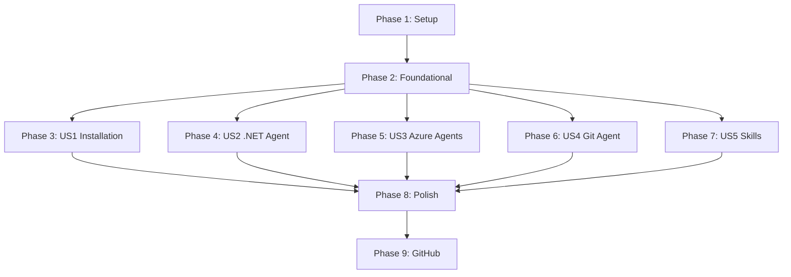

# Implementation Tasks: Claude .NET Plugin

**Feature**: Claude .NET Plugin
**Branch**: `001-installable-plugin`
**Date**: 2025-10-22
**Spec**: [spec.md](./spec.md)
**Plan**: [plan.md](./plan.md)

## Overview

This document defines the execution-ready task list for building the Claude .NET Plugin. Tasks are organized by user story to enable independent implementation and testing, following the priority order from the specification (P1 → P2 → P3).

**Total Tasks**: 142
**MVP Scope**: Phase 1-3 (User Story 1: Plugin Installation and Discovery)

## Task Format

All tasks follow strict format:
```
- [ ] [TaskID] [P?] [Story?] Description with file path
```

- **[P]**: Parallelizable (different files, no dependencies)
- **[Story]**: User story label (US1, US2, US3, US4, US5)

## Phase 1: Setup (Infrastructure)

**Goal**: Initialize plugin directory structure and version control

**Independent Test**: Directory structure exists and matches plan.md specification

### Tasks

- [ ] T001 Create plugin root directory at C:\Users\BobbyJohnson\src\claude-dotnet-plugin
- [ ] T002 [P] Create .claude-plugin directory for manifests
- [ ] T003 [P] Create agents directory for agent markdown files
- [ ] T004 [P] Create skills directory for skill definitions
- [ ] T005 [P] Create migrate directory structure (preserve source content)
- [ ] T006 [P] Create docs/research directory
- [ ] T007 Initialize git repository in plugin root with initial commit

**Completion Criteria**: All directories exist, git initialized

---

## Phase 2: Foundational (Blocking Prerequisites)

**Goal**: Create plugin manifests required for all user stories

**Independent Test**: Manifests validate with ConvertFrom-Json, versions synchronized

### Tasks

- [ ] T008 Create .claude-plugin/plugin.json with name, version 1.0.0, description, author, repository, license, keywords per FR-001
- [ ] T009 Create .claude-plugin/marketplace.json with owner, plugins array, source "." per FR-002
- [ ] T010 Validate plugin.json syntax with PowerShell ConvertFrom-Json
- [ ] T011 Validate marketplace.json syntax with PowerShell ConvertFrom-Json
- [ ] T012 Verify version synchronization between plugin.json (1.0.0) and marketplace.json (1.0.0)
- [ ] T013 Create development marketplace directory at C:\dev\claude-marketplaces\dev-marketplace\.claude-plugin
- [ ] T014 Create dev marketplace.json with absolute path source: C:/Users/BobbyJohnson/src/claude-dotnet-plugin
- [ ] T015 Commit manifests with message "feat: add plugin and marketplace manifests"

**Completion Criteria**: Both manifests valid JSON, versions match, dev marketplace ready

---

## Phase 3: User Story 1 - Plugin Installation and Discovery (P1)

**Story Goal**: Enable users to install plugin and verify it appears in Claude Code without errors

**Independent Test**: Install via dev marketplace, run /help, verify metadata visible, no load errors

**Acceptance Scenarios**:
1. Plugin installs successfully and appears in enabled plugins list
2. `/help` command shows plugin information with descriptions
3. Plugin details display complete metadata (version, author, description, homepage)

### Tasks

- [ ] T016 [US1] Create basic README.md in plugin root with title, description, and placeholder sections per FR-010
- [ ] T017 [US1] Add Features section to README.md listing planned agents and skills
- [ ] T018 [US1] Add Installation section to README.md with marketplace add command
- [ ] T019 [US1] Add Requirements section to README.md (Claude Code 6-month version, Git, Windows 11)
- [ ] T020 [US1] Create LICENSE file with MIT license text per FR-018
- [ ] T021 [US1] Create .gitignore file with OS and IDE exclusions
- [ ] T022 [US1] Commit documentation with message "docs: add README, LICENSE, and gitignore"
- [ ] T023 [US1] Test installation: /plugin marketplace add C:\dev\claude-marketplaces\dev-marketplace
- [ ] T024 [US1] Test installation: /plugin install claude-dotnet-plugin@dev-marketplace
- [ ] T025 [US1] Verify plugin appears in enabled plugins list
- [ ] T026 [US1] Run /help and verify plugin information displays
- [ ] T027 [US1] Check plugin details for complete metadata
- [ ] T028 [US1] Uninstall plugin for next iteration: /plugin uninstall claude-dotnet-plugin@dev-marketplace

**Completion Criteria**: Plugin installs successfully, metadata visible, /help shows plugin, all acceptance tests pass

**MVP Milestone**: With Phase 1-3 complete, plugin is minimally viable (installable and discoverable)

---

## Phase 4: User Story 2 - .NET Development Agent Usage (P1)

**Story Goal**: Provide specialized .NET 9/C# 13 development guidance through dotnet-csharp-expert agent

**Independent Test**: Ask Claude .NET-specific questions, verify agent activates with accurate guidance

**Acceptance Scenarios**:
1. Questions about C# 13 features trigger agent with modern patterns
2. Web API project requests get proper .NET 9 guidance
3. Build errors receive troubleshooting from agent

### Tasks

- [ ] T029 [P] [US2] Read migrate/agents/modern_dotnet_agent.json to understand structure
- [ ] T030 [US2] Create agents/dotnet-csharp-expert.md file
- [ ] T031 [US2] Add YAML frontmatter to dotnet-csharp-expert.md with name: dotnet-csharp-expert, color: green
- [ ] T032 [US2] Add description to frontmatter with 2-3 usage examples in XML format per FR-015
- [ ] T033 [US2] Convert agent_definition.description from JSON to markdown opening paragraph
- [ ] T034 [US2] Convert scope.technologies from JSON to "Your core expertise areas" section with bullet points
- [ ] T035 [P] [US2] Convert commands.project_setup from JSON to "## Project Setup" section with code blocks
- [ ] T036 [P] [US2] Convert commands.development from JSON to "## Development Commands" section
- [ ] T037 [P] [US2] Convert commands.testing from JSON to "## Testing Commands" section
- [ ] T038 [P] [US2] Convert commands.entity_framework from JSON to "## Entity Framework" section
- [ ] T039 [P] [US2] Convert csharp_13_patterns from JSON to "## C# 13 Patterns" section
- [ ] T040 [P] [US2] Convert development_patterns from JSON to "## Development Patterns" section
- [ ] T041 [P] [US2] Convert observability_setup from JSON to "## Observability" section
- [ ] T042 [P] [US2] Convert workflows from JSON to "## Workflows" section
- [ ] T043 [P] [US2] Convert best_practices from JSON to "## Best Practices" section
- [ ] T044 [P] [US2] Convert troubleshooting from JSON to "## Troubleshooting" section
- [ ] T045 [US2] Security audit: scan dotnet-csharp-expert.md for credentials, API keys, connection strings per FR-023
- [ ] T046 [US2] Replace any real credentials with placeholders (e.g., {API_KEY}, user@example.com, example.com)
- [ ] T047 [US2] Validate markdown syntax and code fence closures in dotnet-csharp-expert.md
- [ ] T048 [US2] Commit agent with message "feat: add dotnet-csharp-expert agent with .NET 9/C# 13 guidance"
- [ ] T049 [US2] Reinstall plugin: /plugin install claude-dotnet-plugin@dev-marketplace
- [ ] T050 [US2] Test: Ask "How do I create a new .NET 9 web API project?" and verify agent activation
- [ ] T051 [US2] Test: Ask "What are C# 13 primary constructors?" and verify agent provides guidance
- [ ] T052 [US2] Test: Ask "MSTest build error troubleshooting" and verify agent helps diagnose
- [ ] T053 [US2] Verify agent appears in Claude Code with correct name and description

**Completion Criteria**: dotnet-csharp-expert agent loads without errors, activates on .NET questions, provides accurate .NET 9/C# 13 guidance

---

## Phase 5: User Story 3 - Azure and DevOps Agent Support (P2)

**Story Goal**: Provide Azure architecture and DevOps pipeline guidance through specialized agents

**Independent Test**: Ask Azure/DevOps questions, verify appropriate agent activates with relevant guidance

**Acceptance Scenarios**:
1. Azure service selection questions trigger Azure Architect agent
2. CI/CD pipeline requests get Azure DevOps agent guidance
3. Deployment troubleshooting uses appropriate agent

### Tasks

- [ ] T054 [P] [US3] Read migrate/agents/azure_architect_agent.json
- [ ] T055 [P] [US3] Read migrate/agents/azure_devops_manager_agent.json
- [ ] T056 [US3] Create agents/dotnet-azure-architect.md file
- [ ] T057 [US3] Add YAML frontmatter to dotnet-azure-architect.md with name: dotnet-azure-architect, color: blue
- [ ] T058 [US3] Add description with usage examples for Azure architecture scenarios
- [ ] T059 [US3] Convert azure_architect JSON content to markdown sections (services, patterns, architecture)
- [ ] T060 [US3] Security audit dotnet-azure-architect.md for sensitive Azure configurations
- [ ] T061 [US3] Replace real Azure examples with generic placeholder values
- [ ] T062 [US3] Create agents/dotnet-azure-devops.md file
- [ ] T063 [US3] Add YAML frontmatter to dotnet-azure-devops.md with name: dotnet-azure-devops, color: blue
- [ ] T064 [US3] Add description with usage examples for DevOps pipeline scenarios
- [ ] T065 [US3] Convert azure_devops JSON content to markdown sections (pipelines, YAML, releases)
- [ ] T066 [US3] Security audit dotnet-azure-devops.md for sensitive pipeline configurations
- [ ] T067 [US3] Commit agents with message "feat: add Azure Architect and Azure DevOps agents"
- [ ] T068 [US3] Reinstall plugin and test Azure architecture question activation
- [ ] T069 [US3] Test DevOps pipeline question triggers correct agent
- [ ] T070 [US3] Verify both agents load without errors

**Completion Criteria**: Both Azure agents load successfully, activate on appropriate questions, provide relevant guidance

---

## Phase 6: User Story 4 - Git Workflow Management (P3)

**Story Goal**: Provide Git operation guidance following team conventions and best practices

**Independent Test**: Request Git operations, verify Git Manager agent provides appropriate commands

**Acceptance Scenarios**:
1. Branch creation requests get proper Git commands
2. Merge conflict help provides resolution strategies
3. Commit guidance includes conventional commit format

### Tasks

- [ ] T071 [P] [US4] Read migrate/agents/git_manager_agent.json
- [ ] T072 [US4] Create agents/dotnet-git-manager.md file
- [ ] T073 [US4] Add YAML frontmatter with name: dotnet-git-manager, color: gray
- [ ] T074 [US4] Add description with Git workflow usage examples
- [ ] T075 [US4] Convert git_manager JSON content to markdown sections (workflows, branching, commits)
- [ ] T076 [US4] Security audit for any internal repository references or real organization names
- [ ] T077 [US4] Commit agent with message "feat: add dotnet-git-manager agent for Git workflows"
- [ ] T078 [US4] Reinstall plugin and test Git branch creation question
- [ ] T079 [US4] Test merge conflict help activation
- [ ] T080 [US4] Verify agent provides conventional commit guidance

**Completion Criteria**: Git Manager agent loads, activates on Git questions, provides workflow guidance

---

## Phase 7: User Story 5 - Project Template Usage (P3)

**Story Goal**: Enable README generation using standardized templates with combined triggers

**Independent Test**: Request README generation, verify appropriate skill triggers and creates README

**Acceptance Scenarios**:
1. Explicit "create README" requests trigger appropriate template
2. Missing README.md in library project triggers automatic offer
3. Project initialization contexts suggest README generation
4. Custom section requests adapt template

### Tasks

- [ ] T081 [P] [US5] Read migrate/templates/lib-project-readme-template.md
- [ ] T082 [P] [US5] Read migrate/templates/script-project-readme-template.md
- [ ] T083 [US5] Create skills/readme-library-template directory
- [ ] T084 [US5] Create skills/readme-library-template/SKILL.md file
- [ ] T085 [US5] Add YAML frontmatter to library SKILL.md with name: README Library Template
- [ ] T086 [US5] Add description with combined triggers: explicit requests, missing README detection, project initialization
- [ ] T087 [US5] Add allowed-tools: [Write, Read, Glob] to frontmatter
- [ ] T088 [US5] Convert library template content to skill implementation section
- [ ] T089 [US5] Add trigger scenarios section documenting explicit, detection, and initialization triggers
- [ ] T090 [US5] Create skills/readme-script-template directory
- [ ] T091 [US5] Create skills/readme-script-template/SKILL.md file
- [ ] T092 [US5] Add YAML frontmatter to script SKILL.md with name: README Script Template
- [ ] T093 [US5] Add description with combined triggers for script projects
- [ ] T094 [US5] Add allowed-tools: [Write, Read, Glob] to frontmatter
- [ ] T095 [US5] Convert script template content to skill implementation
- [ ] T096 [US5] Commit skills with message "feat: add README template skills with combined triggers"
- [ ] T097 [US5] Reinstall plugin and test explicit "create README for library" request
- [ ] T098 [US5] Test script README generation request
- [ ] T099 [US5] Verify skills appear in Claude Code skill list

**Completion Criteria**: Both README skills load, trigger on requests, generate appropriate templates

---

## Phase 8: Polish & Cross-Cutting Concerns

**Goal**: Add meta agents, complete documentation, validate all components, prepare for release

**Independent Test**: All 7 agents load, documentation complete, validation passes, ready for GitHub

### Tasks

- [ ] T100 [P] Read migrate/agents/meta/agent-expert.md
- [ ] T101 [P] Read migrate/agents/meta/feature-prompt.md
- [ ] T102 [P] Read migrate/agents/meta/readme-maintainer.md
- [ ] T103 [P] Read migrate/agents/meta/mcp-expert.md
- [ ] T104 [P] Copy agent-expert.md to agents/dotnet-agent-expert.md
- [ ] T105 [P] Copy feature-prompt.md to agents/dotnet-feature-prompt.md
- [ ] T106 [P] Copy readme-maintainer.md to agents/dotnet-readme-maintainer.md
- [ ] T107 [P] Copy mcp-expert.md to agents/dotnet-mcp-expert.md
- [ ] T108 Edit dotnet-agent-expert.md frontmatter: change name to dotnet-agent-expert
- [ ] T109 Edit dotnet-feature-prompt.md frontmatter: change name to dotnet-feature-prompt
- [ ] T110 Edit dotnet-readme-maintainer.md frontmatter: change name to dotnet-readme-maintainer
- [ ] T111 Edit dotnet-mcp-expert.md frontmatter: change name to dotnet-mcp-expert
- [ ] T112 Security audit all 4 meta agents for credentials or sensitive patterns
- [ ] T113 Commit meta agents with message "feat: add meta agents with dotnet- namespace prefix"
- [ ] T114 Update README.md with complete agent list (7 agents: 4 primary + 3 meta)
- [ ] T115 Update README.md with skill list (2 skills)
- [ ] T116 Add Usage section to README.md with agent activation examples
- [ ] T117 Add Agents section to README.md with descriptions for all 7 agents
- [ ] T118 Create CHANGELOG.md with version 1.0.0 entry per FR-011
- [ ] T119 Add "Added" section to CHANGELOG listing all agents, skills, features per FR-011
- [ ] T120 Add "Security" section to CHANGELOG noting content sanitization per FR-011
- [ ] T121 Commit documentation with message "docs: complete README and CHANGELOG for v1.0.0" per FR-011
- [ ] T122 Validate all agents have dotnet- prefix in name field
- [ ] T123 Validate all agent descriptions include 2-3 usage examples
- [ ] T124 Validate all skills have proper allowed-tools frontmatter
- [ ] T125 Validate no credentials exist in any agent or skill files
- [ ] T126 Validate all markdown files follow CommonMark specification
- [ ] T127 Run PowerShell validation on plugin.json and marketplace.json
- [ ] T128 Verify version synchronization: plugin.json = marketplace.json = 1.0.0
- [ ] T129 Reinstall plugin and verify all 7 agents load without errors
- [ ] T130 Test each agent activates on appropriate questions
- [ ] T131 Test both skills trigger on expected phrases
- [ ] T132 Run constitution compliance checklist against final plugin structure
- [ ] T133 Commit final validation with message "test: validate all components pass quality gates"

**Completion Criteria**: All agents and skills load, documentation complete, validation passes, ready for GitHub publication

---

## Phase 9: GitHub Publication (Post-Implementation)

**Goal**: Publish plugin to GitHub and create v1.0.0 release

**Tasks**:

- [ ] T134 Create GitHub repository: claude-dotnet-plugin (public)
- [ ] T135 Add remote origin to local git repository
- [ ] T136 Push main branch to GitHub
- [ ] T137 Create git tag v1.0.0 with message "Release version 1.0.0 - Initial plugin"
- [ ] T138 Push tag to GitHub: git push origin v1.0.0
- [ ] T139 Create GitHub Release for v1.0.0 using CHANGELOG.md content
- [ ] T140 Test installation from GitHub: /plugin marketplace add BobbyJohnson/claude-dotnet-plugin
- [ ] T141 Test installation: /plugin install claude-dotnet-plugin
- [ ] T142 Verify public installation works correctly

---

## Implementation Strategy

### MVP First (Phases 1-3)

**Deliverable**: Installable plugin with valid manifests and documentation
- Users can install plugin via marketplace
- Plugin metadata visible in Claude Code
- Foundation for all subsequent agent/skill additions

**Estimated Effort**: 15 tasks, ~2 hours

### Core Value (Phase 4)

**Deliverable**: .NET development agent providing P1 functionality
- Specialized .NET 9/C# 13 guidance available
- Immediate developer productivity value
- 60% of user needs addressed

**Estimated Effort**: 25 tasks, ~4 hours (includes conversion and testing)

### Extended Value (Phases 5-7)

**Deliverable**: All specialized agents and skills operational
- Azure/DevOps guidance (P2)
- Git workflow support (P3)
- README generation (P3)
- 100% of user stories implemented

**Estimated Effort**: 49 tasks, ~6 hours

### Production Ready (Phase 8)

**Deliverable**: Polished, validated, documented plugin
- All 7 agents with namespace prefixes
- Complete documentation
- Security validated
- Constitution compliant

**Estimated Effort**: 34 tasks, ~3 hours

**Total Estimated Effort**: ~15 hours for complete implementation

---

## Dependency Graph



**Key Insights**:
- Phase 1-2 are sequential (setup prerequisites)
- Phases 3-7 can run independently after Phase 2 complete
- Phase 8 requires all user story phases complete
- Phase 9 is final publication step

---

## Parallel Execution Opportunities

### Within Phase 4 (US2 - .NET Agent Conversion)

Tasks T035-T044 can execute in parallel (different sections):
```powershell
# All independent section conversions
T035, T036, T037, T038, T039, T040, T041, T042, T043, T044
```

### Within Phase 5 (US3 - Azure Agents)

Tasks T054-T055 and T056-T066 can run in parallel (different agents):
```powershell
# Azure Architect and Azure DevOps conversions independent
T054-T061 (Azure Architect)
T055, T062-T066 (Azure DevOps)
```

### Within Phase 8 (Meta Agents)

Tasks T100-T107 can execute in parallel (different files):
```powershell
# All meta agent copies independent
T100, T101, T102, T103, T104, T105, T106, T107
```

**Parallel Potential**: ~30% of tasks marked [P] can run concurrently with proper tooling

---

## Validation Checkpoints

### After Phase 3 (MVP)
- [ ] Plugin installs without errors
- [ ] Metadata visible in Claude Code
- [ ] /help displays plugin information
- [ ] Git repository initialized with commits

### After Phase 4 (Core Agent)
- [ ] dotnet-csharp-expert agent loads
- [ ] Agent activates on .NET questions
- [ ] Agent provides accurate guidance
- [ ] Security audit passed

### After Phase 8 (Production Ready)
- [ ] All 7 agents load without errors
- [ ] All 2 skills trigger correctly
- [ ] Documentation complete (README, CHANGELOG, LICENSE)
- [ ] All validations pass (JSON, markdown, security)
- [ ] Constitution compliance 100%

---

## Success Criteria Mapping

| Success Criterion | Validated By Tasks | Phase |
|-------------------|-------------------|-------|
| SC-001: Install < 2 min | T023-T025 | 3 |
| SC-002: 7 agents load without errors | T129 | 8 |
| SC-003: Agent response < 5 sec | T050-T052, T068-T070, T078-T080, T097-T098 | 4-7 |
| SC-004: Structure passes compliance | T132 | 8 |
| SC-005: README comprehensive | T016-T019, T114-T117 | 3, 8 |
| SC-006: Descriptions trigger selection | T032, T058, T064, T074, T086, T093 | 4-7 |
| SC-007: No interference | T025, T129, T140-T141 | 3, 8, 9 |
| SC-008: Update to 1.1.0 possible | Version structure validation T128 | 8 |

---

## Risk Mitigation

**Risk**: Agent conversion loses domain knowledge
**Mitigation**: Tasks T029-T044 systematically convert all JSON sections to markdown

**Risk**: Security audit misses credentials
**Mitigation**: Tasks T045-T046, T060-T061, T066, T076, T112 audit each agent individually

**Risk**: Skills don't trigger correctly
**Mitigation**: Tasks T086-T087, T089, T093-T094 specify combined trigger strategy

**Risk**: Version desynchronization
**Mitigation**: Task T012, T128 validate version alignment at multiple checkpoints

---

## Notes

- No test tasks included (not explicitly requested in specification)
- All tasks are execution-ready with specific file paths
- Security audit tasks integrated into each conversion phase
- Local testing with dev marketplace validated after each major phase
- Constitution compliance validated in Phase 8 before publication
- Each user story independently testable per specification requirements
